# Agent Orchestration Workflow (Supervisor-Planner-Critic Pattern)

## 🎯 Architecture Overview

The agent system uses a **Supervisor-Planner-Critic** pattern for intelligent document extraction.

```mermaid
graph TD
    Start([Document Input]) --> Planner[🧠 Planner Agent<br/>qwen3:0.6b<br/>Create Extraction Strategy]
    
    Planner --> Supervisor{📋 Supervisor Agent<br/>qwen3:0.6b<br/>Route to Best Agent}
    
    Supervisor -->|Need Type Detection| Schema[🔍 Schema Agent<br/>qwen3:0.6b<br/>Classify Document]
    Supervisor -->|Need Vision Analysis| Vision[👁️ Vision Agent<br/>gemma3:4b<br/>Layout & Structure]
    Supervisor -->|Need Content| Extract[📝 Extraction Agent<br/>qwen3:0.6b<br/>Key-Value Pairs]
    Supervisor -->|Need Tables| TableAgent[📊 Table Parser<br/>qwen3:0.6b<br/>Enhanced Tables]
    Supervisor -->|Ready for Review| Critic[✅ Critic Agent<br/>qwen3:0.6b<br/>Quality Check]
    Supervisor -->|Complete| End
    
    Schema --> Supervisor
    Vision --> Supervisor
    Extract --> Supervisor
    TableAgent --> Supervisor
    
    Critic -->|Issues Found| Supervisor
    Critic -->|Approved| End([✨ Final Output<br/>JSON/Markdown])
    
    style Planner fill:#e1f5ff
    style Supervisor fill:#fff4e1
    style Schema fill:#ffe1f5
    style Vision fill:#e1ffe1
    style Extract fill:#f5e1ff
    style TableAgent fill:#ffe1e1
    style Critic fill:#f5ffe1
    style Start fill:#e8e8e8
    style End fill:#90EE90
```



## 🏗️ Three-Layer Architecture

### Layer 1: Coordination (Supervisor-Planner-Critic)

| Agent | Model | Role |
|-------|-------|------|
| **Planner** | qwen3:0.6b | Analyzes document and creates extraction strategy |
| **Supervisor** | qwen3:0.6b | Routes workflow to appropriate sub-agents |
| **Critic** | qwen3:0.6b | Evaluates quality and decides if re-extraction needed |

### Layer 2: Specialized Sub-Agents

| Agent | Model | Purpose |
|-------|-------|---------|
| **Schema Detection** | qwen3:0.6b | Classifies document type |
| **Vision Analysis** | gemma3:4b | Understands image layout (images only) |
| **Content Extraction** | qwen3:0.6b | Extracts key-value pairs & entities |
| **Table Parser** | qwen3:0.6b | Enhances table extraction |

### Layer 3: Legacy (Phase 1 - Still Used)

| Component | Purpose |
|-----------|---------|
| **PDF Reader** | Fast text extraction |
| **DOCX Reader** | Document parsing |
| **OCR Engines** | PaddleOCR + Tesseract |

## 🔄 Workflow Steps

### 1. Planner Agent 🧠
**Input**: Raw document text  
**Process**:
- Quick-scan to understand document nature
- Identify what data needs extraction
- Determine best approach (basic/advanced/vision)
- Create extraction plan

**Output**: Extraction strategy
```json
{
  "document_category": "admission_ticket",
  "extraction_approach": "advanced",
  "key_fields_to_extract": ["name", "exam_date", "register_number"],
  "complexity": "medium",
  "recommended_agents": ["schema", "extraction", "critic"]
}
```

### 2. Supervisor Agent 📋
**Input**: Current state + plan  
**Process**:
- Evaluates what's been done
- Decides which agent should run next
- Routes to appropriate sub-agent
- Prevents infinite loops

**Routing Logic**:
```
No document type? → Schema Agent
Is image? → Vision Agent
No structured data? → Extraction Agent
Has tables? → Table Parser
Ready for review? → Critic Agent
All done? → Complete
```

### 3. Schema Detection Agent 🔍
**Input**: Raw text  
**Output**: Document type + schema
```json
{
  "document_type": "admission_ticket",
  "confidence": 0.92,
  "key_fields": ["candidate_name", "exam_date", "register_number"]
}
```

### 4. Vision Agent 👁️ (Images Only)
**Input**: Image file path  
**Model**: gemma3:4b (multimodal)  
**Output**: Layout analysis
```json
{
  "layout_type": "form",
  "has_tables": true,
  "quality": "clear",
  "text_regions": ["header", "body", "table"]
}
```

### 5. Extraction Agent 📝
**Input**: Raw text + schema  
**Output**: Structured data + entities
```json
{
  "candidate_name": "SREEJITH G",
  "register_number": "Z 2003528",
  "exam_date": "27-09-2025",
  "entities": [
    {"text": "SREEJITH G", "entity_type": "person"},
    {"text": "27-09-2025", "entity_type": "date"}
  ]
}
```

### 6. Table Parser Agent 📊
**Input**: Detected tables  
**Output**: Enhanced tables
- Improved headers
- Data type identification
- Relationship detection

### 7. Critic Agent ✅
**Input**: All extracted data  
**Process**:
- Evaluates completeness
- Checks accuracy
- Validates consistency
- Calculates confidence score

**Output**: Quality report + verdict
```json
{
  "overall_quality": "good",
  "confidence_score": 0.92,
  "completeness": 0.95,
  "issues_found": [],
  "final_verdict": "approve"
}
```

## 🎯 Why Supervisor-Planner-Critic?

### Advantages

1. **Intelligent Routing** 🧠
   - Supervisor adapts to document type
   - No fixed pipeline - flexible workflow
   - Agents run only when needed

2. **Quality Assurance** ✅
   - Critic provides objective evaluation
   - Can request re-extraction if quality low
   - Confidence scoring

3. **Strategic Planning** 📋
   - Planner optimizes approach per document
   - Reduces unnecessary processing
   - Estimates complexity upfront

4. **Modularity** 🧩
   - Easy to add new sub-agents
   - Each agent has single responsibility
   - Agents are independent and testable

5. **Self-Correction** 🔄
   - Critic can trigger re-extraction
   - Supervisor learns from errors
   - Adaptive workflow

## 📊 Performance

### Processing Time (Average)

| Document Type | Agents Used | Time |
|--------------|-------------|------|
| Simple PDF | Planner → Schema → Extraction → Critic | ~3-5s |
| Complex Form | + Table Parser | ~8-12s |
| Scanned Image | + Vision Agent | ~10-15s |

### Agent Call Times

| Agent | Model | Avg Time |
|-------|-------|----------|
| Planner | qwen3:0.6b | ~0.5s |
| Supervisor | qwen3:0.6b | ~0.3s |
| Schema | qwen3:0.6b | ~0.8s |
| Vision | gemma3:4b | ~1.5s |
| Extraction | qwen3:0.6b | ~1.2s |
| Table Parser | qwen3:0.6b | ~0.8s |
| Critic | qwen3:0.6b | ~1.0s |

## 🎓 Example Workflow

### Input: Admission Ticket PDF

**Step 1: Planner**
```
✓ Scanned document → suggests "advanced" approach
✓ Detected forms → recommends schema + extraction + critic
```

**Step 2: Supervisor** → Routes to Schema

**Step 3: Schema Agent**
```
✓ Detected: "admission_ticket"
✓ Key fields: name, register_number, exam_date, exam_centre
```

**Step 4: Supervisor** → Routes to Extraction

**Step 5: Extraction Agent**
```
✓ Extracted: candidate_name = "SREEJITH G"
✓ Extracted: register_number = "Z 2003528"
✓ Extracted: exam_date = "27-09-2025"
✓ Found 24 entities
```

**Step 6: Supervisor** → Routes to Table Parser (tables detected)

**Step 7: Table Parser**
```
✓ Enhanced 2 tables
✓ Improved headers
```

**Step 8: Supervisor** → Routes to Critic

**Step 9: Critic**
```
✓ Quality: good
✓ Confidence: 92%
✓ Verdict: APPROVE
```

**Step 10**: Complete! 🎉

## 🛠️ Configuration

```env
# Enable AI features
ENABLE_ENTITY_EXTRACTION=true
ENABLE_VISION_MODEL=true

# Models
LLM_MODEL=qwen3:0.6b           # Supervisor, Planner, Critic, Sub-agents
LLM_VISION_MODEL=gemma3:4b     # Vision agent
```

## 🚀 Usage

```bash
# Use the intelligent supervisor workflow
uv run agent-extract extract document.pdf --ai

# View agent workflow graph
start agent-orch.png  # Windows
open agent-orch.png   # macOS
```

## 🎯 Future Enhancements

- Custom agent addition
- Agent learning from feedback
- Parallel agent execution
- Agent performance metrics
- Dynamic routing strategies

---

**The Supervisor-Planner-Critic architecture provides intelligent, adaptive, and high-quality document extraction!** 🎉
